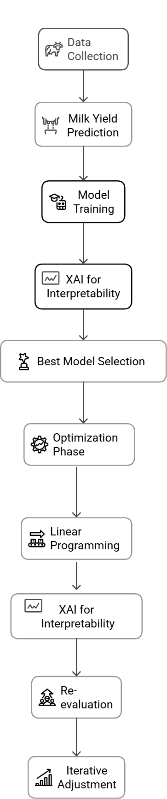

<div align="center">

# Enhancing Milk Yield Forecasting in Dairy Farming using an Interpretable Machine Learning Framework

### Explainable AI and Optimization-Based Framework for Precision Dairy Farming

> 📄 Detailed methodology, experiments, implementation, and results are available in the research paper PDF attached in this repository.

</div>

---

# Overview

This project presents an interpretable machine learning framework for milk yield prediction and optimization in dairy farming. The framework combines multiple machine learning models with Explainable AI (XAI) techniques such as SHAP and LIME to improve prediction accuracy while providing interpretable insights into the factors influencing milk production.

The study further integrates optimization techniques to recommend effective feed composition strategies for improving dairy farm productivity and sustainability.

---

# Dataset

The project uses a dairy farming dataset containing milk production, feed composition, cattle characteristics, and management-related attributes for milk yield prediction and optimization.

### Dataset Features
- Green Fodder (Kg)
- Dry Fodder (Kg)
- Concentrate Feed (Kg)
- Breed
- Lactation Period
- Milk Fat %
- Lactometer Reading
- Vitamin Intake
- Mineral Mixture
- Azolla Feed
- Calcium Supplement Injections
- Milk Yield

Dataset file included in the repository:

```text
milk_yield_prediction_dataset.csv
```

---

# Methodology

The framework consists of two major phases:

### Phase I — Milk Yield Prediction
- Data preprocessing and feature engineering
- Training and evaluation of multiple ML models
- Explainable AI analysis using SHAP and LIME

### Phase II — Milk Yield Optimization
- Feed optimization using Linear Programming
- Re-evaluation using XAI insights
- Iterative optimization for improved milk production

---

# Workflow

<div align="center">

</div>

---

# Models Used

- Random Forest Regression
- XGBoost Regressor
- Ridge Regression
- Lasso Regression
- Support Vector Regression (SVR)
- k-Nearest Neighbors (KNN)
- Ensemble Models
- Polynomial Regression

---

# Explainable AI Techniques

- SHAP (SHapley Additive Explanations)
- LIME (Local Interpretable Model-Agnostic Explanations)

These techniques were used to analyze feature importance and provide interpretable insights into milk yield prediction.

---

# Technologies Used

- Python
- Scikit-learn
- XGBoost
- SHAP
- LIME
- Pandas
- NumPy
- Matplotlib
- Jupyter Notebook

---

# Repository Structure

```bash
├── notebooks/
│   ├── milk_yield_prediction_xai.ipynb
│   └── milk_yield_optimization.ipynb
│
├── figures/
│   └── workflow.png
│
├── milk_yield_prediction_dataset.csv
├── README.md
├── requirements.txt
└── research_paper.pdf
```

---

# Installation

Clone the repository:

```bash id="mxj2jj"
git clone https://github.com/your-username/Explainable-Milk-Yield-Prediction-and-Optimization.git
```

Install dependencies:

```bash id="rq3h8v"
pip install -r requirements.txt
```

---

# Applications

- Precision dairy farming
- Milk yield forecasting
- Feed optimization
- Explainable AI in agriculture
- Data-driven farm management

---

# Authors

- Srinithi B  
- Sruthi Nirmala S R  

---

# Academic Collaboration

This project was developed as a collaborative research initiative between:

- Amrita Vishwa Vidyapeetham  
  Amrita School of Physical Sciences, Coimbatore  

- ICAR-KVK, Virinjipuram, Vellore  

---

# Project Guidance

### Dr. M. Ramasamy  
Assistant Professor  
ICAR-KVK, Virinjipuram, Vellore  

### Senthil Kumar Thangavel  
Department of Computer Science and Engineering  
Amrita School of Engineering  
Amrita Vishwa Vidyapeetham
